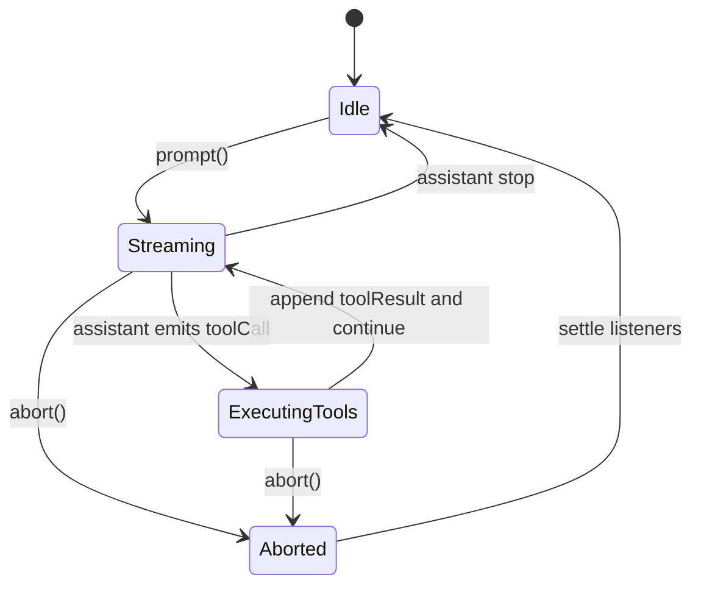
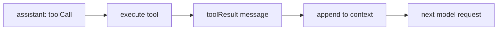

# 消息、流式事件与状态

Agent 的核心数据结构不是字符串，而是消息列表。

原因很简单：模型每次请求都需要看到一个可解释的上下文，而工具调用也必须作为消息回到模型视野里。否则模型会不知道“刚才那个工具到底执行出了什么”。

## 三类基础消息

Pi 的基础消息来自 `pi-ai`，可以简化成这样：

```ts
type Message = UserMessage | AssistantMessage | ToolResultMessage;

interface UserMessage {
  role: "user";
  content: string | ContentBlock[];
  timestamp: number;
}

interface AssistantMessage {
  role: "assistant";
  content: Array<TextBlock | ThinkingBlock | ToolCallBlock>;
  stopReason: "stop" | "length" | "toolUse" | "error" | "aborted";
  usage: Usage;
  timestamp: number;
}

interface ToolResultMessage {
  role: "toolResult";
  toolCallId: string;
  toolName: string;
  content: ContentBlock[];
  isError: boolean;
  timestamp: number;
}
```

这里最重要的是：`AssistantMessage.content` 里不只有文本，还可能有 `toolCall`。Agent Loop 会扫描这些 tool call，然后执行对应工具。

## 流式事件为什么重要

如果后端只返回最终消息，用户会看到一个长时间空白的页面。Pi 的做法是把模型生成过程和工具执行过程都转成事件：

| 事件 | 说明 | UI 可以怎么用 |
| --- | --- | --- |
| `agent_start` | 一次运行开始 | 显示工作中状态 |
| `turn_start` | 一轮模型请求开始 | 新建时间线节点 |
| `message_start` | 一条消息开始 | 创建消息气泡 |
| `message_update` | 助手消息流式更新 | 追加文本、显示 thinking、显示 tool call |
| `message_end` | 一条消息结束 | 固化消息 |
| `tool_execution_start` | 工具开始执行 | 展示工具名称和参数 |
| `tool_execution_update` | 工具输出中间结果 | 展示 bash 实时输出这类信息 |
| `tool_execution_end` | 工具结束 | 展示结果、错误或耗时 |
| `turn_end` | 一轮结束 | 判断是否还有工具结果 |
| `agent_end` | 整次运行结束 | 恢复输入框 |

## 状态机视角



Pi 的 `Agent` 类会维护这些状态：

| 状态 | 作用 |
| --- | --- |
| `messages` | 当前对话记录 |
| `tools` | 当前可用工具 |
| `isStreaming` | 是否正在处理 |
| `streamingMessage` | 当前还没完成的助手消息 |
| `pendingToolCalls` | 正在执行的工具调用 ID 集合 |
| `errorMessage` | 最近一次错误 |

## 设计要点

### 消息是事实来源

不要只把消息渲染到 UI，然后忘了保存结构化数据。后续的模型请求、会话恢复、压缩和分支都依赖结构化消息。

### 事件是投影

事件适合驱动 UI、日志、插件，不适合作为唯一存储。Pi 会在 `message_end` 时把消息写入会话，而不是只保存“事件日志”。

### 工具结果也必须是消息

很多初学者会犯这个错误：工具执行完之后直接把结果显示给用户，却没有把结果追加到模型上下文。这样模型下一轮还是不知道工具输出。

正确做法是：



## 小练习

把 `examples/demos/02-tools.ts` 里的工具结果文本改成错误消息，再观察下一轮模型会如何根据 `isError` 和内容生成最终回复。
