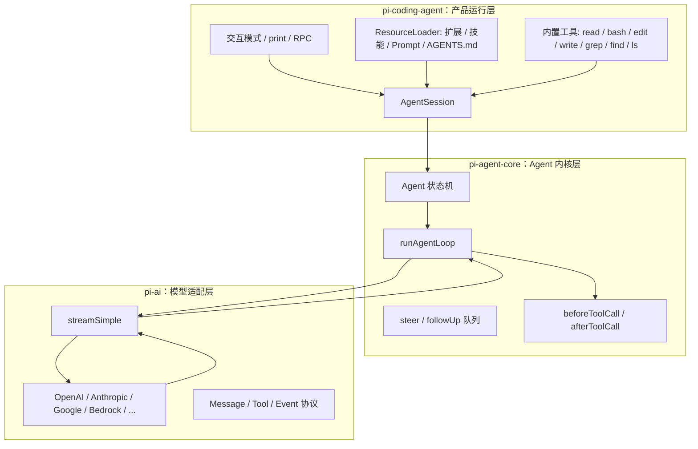
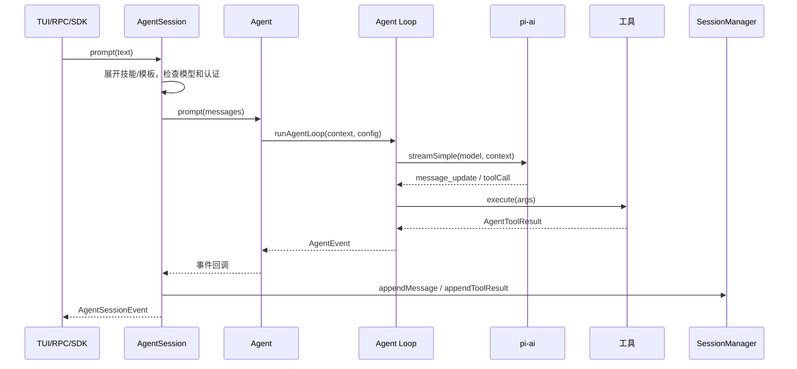
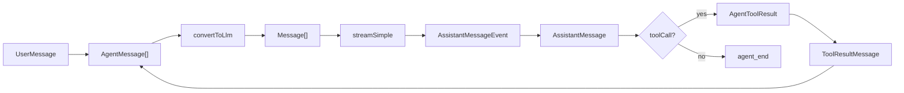

# Pi 的总体架构

Pi 的架构最值得学习的地方，是它把“不稳定的外部世界”和“稳定的核心循环”分开了。

大模型供应商会变，工具会变，UI 会变，用户想安装的扩展也会变。但 Agent Loop 的本质相对稳定：准备上下文、请求模型、处理工具、写回结果、继续或停止。

## 三层分工

## 每层为什么存在

### `pi-ai`：把供应商差异关在一层

不同模型 API 对工具调用、推理内容、缓存、错误、OAuth、流式协议的表达都不同。Pi 把这些差异统一成 `Message`、`Tool`、`AssistantMessageEvent` 和 `streamSimple()`。

这样上层 Agent Loop 不需要知道“这是 Anthropic 的 tool_use，还是 OpenAI Responses 的 function call”。它只关心统一后的 `toolCall` 内容块。

### `pi-agent-core`：只管 Agent 运行时

这一层不关心终端 UI，也不关心 `.pi/extensions` 在哪里。它主要处理：

| 模块 | 职责 |
| --- | --- |
| `Agent` | 保存状态、暴露 `prompt()`、`steer()`、`followUp()`、`abort()` |
| `runAgentLoop` | 真正的循环：模型请求、工具执行、下一轮判断 |
| `AgentEvent` | 把生命周期、消息更新、工具执行过程发出去 |
| hooks | 在工具执行前后给产品层和扩展拦截机会 |

这一层越小，越容易测试。Pi 的 `packages/agent/test/agent-loop.test.ts` 就是在验证这些控制流。

### `pi-coding-agent`：把 Agent 变成可用产品

写一个 Agent Loop 不难，难的是把它变成每天能用的开发工具。产品层负责这些“麻烦但关键”的事情：

| 能力 | 为什么重要 |
| --- | --- |
| 会话 JSONL | 重启后可以继续；可以回到某个节点重新分支 |
| 资源加载 | 自动加载项目规则、技能、提示模板、扩展 |
| 内置工具 | 读文件、执行命令、编辑代码是 coding agent 的基本动作 |
| 上下文压缩 | 长会话不至于爆上下文窗口 |
| 扩展系统 | 用户能加权限门、远程执行、定制 UI、接入外部服务 |
| 多运行模式 | 同一核心可以服务 TUI、脚本、RPC 集成 |

## 一次请求的完整链路

## 教学版项目会怎么缩小

真实 Pi 要处理很多供应商、平台、扩展和长期会话。我们的教学版会保留核心思想，但做四个简化：

| Pi 真实实现 | 教学版实现 |
| --- | --- |
| 多模型供应商 | 一个确定性 `MockModel`，可替换成真实 API |
| 全量扩展系统 | 简化为工具注册表和 hooks |
| 完整 JSONL 树 | 保留 `id`/`parentId`/`leafId` 的最小会话树 |
| TUI/RPC/print | React 页面 + Node API |

这样读者能先把骨架吃透，再决定要不要补齐生产级能力。

## 学习路径上的源码入口

如果你已经理解三层架构，下一步不要立刻通读整个 monorepo。建议按下面路线走：

| 想理解的问题 | 继续阅读 |
| --- | --- |
| 模型适配为什么要单独一层 | [pi-ai 模型协议层](/source/model-protocol) |
| Agent Loop 到底怎么停下来 | [Agent Loop 主循环](/source/agent-loop) |
| 工具、扩展、技能谁管谁 | [工具、扩展与资源加载](/source/tools-extensions) |
| `session.prompt()` 为什么做这么多 preflight | [AgentSession 运行层](/source/agent-session) |
| JSONL 会话树和压缩怎么恢复上下文 | [会话格式与压缩链路](/source/session-compaction) |

## 模块之间传递的不是“字符串”

很多初学者会把 Agent 理解成“把 prompt 拼成字符串发给模型”。Pi 的设计更接近一组结构化协议在层与层之间流动：

这一点决定了后面的所有工程选择：

| 设计选择 | 原因 |
| --- | --- |
| 消息是结构化对象 | 工具调用、图片、thinking、错误、token 用量都不是普通文本能可靠表达的 |
| 事件是增量协议 | UI 需要看到流式输出和工具执行过程，而不是只等最终答案 |
| 工具定义是 schema | 模型需要知道参数形状，运行时也要校验参数 |
| 会话条目是 JSONL | 长会话需要 append、恢复、分支和压缩 |

## 读架构时抓住两个边界

第一个边界是 **LLM 边界**：进入模型前，AgentMessage 会被转换成模型供应商能接受的 Message；离开模型后，供应商事件会被统一成 Pi 的 assistant message event。

第二个边界是 **副作用边界**：模型不能直接读写文件或执行命令，它只能提出 tool call。真正的副作用发生在本地工具里，并且可以被 hook、权限策略和参数校验拦住。

把这两个边界抓稳，就不容易被 Pi 的 TUI、扩展、设置和 provider 兼容性绕晕。
