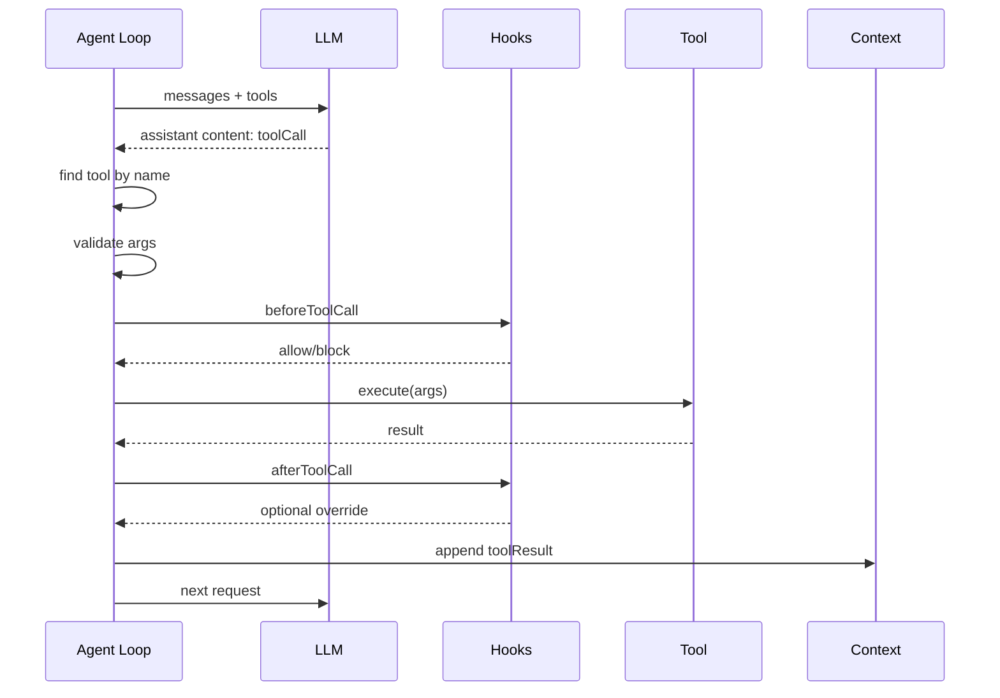

# 工具调用机制

工具是 Agent 从“会说话”变成“能做事”的关键。

Pi 的工具设计有三个核心点：

1. 工具定义要能发给模型，让模型知道什么时候用、怎么传参。
2. 工具执行要在本地运行时完成，模型只负责提出调用请求。
3. 工具结果要回写成 `toolResult` 消息，再交给模型继续推理。

## 工具定义

一个工具最少包含：

| 字段 | 作用 |
| --- | --- |
| `name` | 模型调用时使用的稳定名称 |
| `description` | 告诉模型什么时候应该调用 |
| `parameters` | 参数 schema，用于模型理解和运行时校验 |
| `execute` | 本地真正执行工具的函数 |

教学版中我们用 Zod/手写类型都可以。Pi 源码使用 TypeBox schema，并在执行前调用 `validateToolArguments()`。

```ts
interface AgentTool<TArgs, TResult> {
  name: string;
  description: string;
  parameters: unknown;
  execute(args: TArgs, signal?: AbortSignal): Promise<TResult>;
}
```

## 工具调用链路



## 为什么要有 before/after hooks

工具很强，也很危险。让模型直接执行 shell 或写文件，必须有拦截点。

| hook | 常见用途 |
| --- | --- |
| `beforeToolCall` | 权限审批、路径保护、命令黑名单、参数改写 |
| `afterToolCall` | 脱敏输出、截断超长结果、记录审计日志、把结果改成结构化摘要 |

Pi 的扩展系统就通过这些 hook 实现很多能力，比如阻止危险命令、修改工具结果、定制压缩。

## 并行与串行

Pi 支持同一条助手消息里多个工具调用。默认可以并行，但某些工具需要串行。

| 模式 | 适合场景 | 风险 |
| --- | --- | --- |
| parallel | 多个只读操作，例如 grep、read、find | 输出顺序与完成顺序不同，需要回写时保持原始调用顺序 |
| sequential | 写文件、执行依赖前一步结果的命令 | 慢一些，但更容易保证副作用顺序 |

Pi 的做法是：可以并发执行允许并发的工具，但生成 `toolResult` 消息时仍按助手原始 tool call 顺序写回，避免模型看到错乱上下文。

## 工具 prompt 和工具 schema 要分开看

工具有两种“说明书”：

| 说明书 | 给谁看 | 例子 |
| --- | --- | --- |
| `description` + `parameters` | 给模型和参数校验器 | `read_file(path: string)` |
| system prompt 中的工具准则 | 给模型的行为策略 | “读取文件前先用 grep/ls 缩小范围” |

Pi 的内置工具会把一行 `promptSnippet` 和若干 `promptGuidelines` 合入系统提示词。这样模型不仅知道“有 read 工具”，还知道“什么时候该用 read、什么时候先搜索”。教学版没有实现完整 prompt guideline，但你应该知道生产级 Agent 需要这层。

## 错误也是工具结果

工具不存在、参数校验失败、被 hook 阻止、执行抛错，都不应该让整个进程直接炸掉。更好的做法是返回一个 `isError: true` 的 `toolResult`，让模型有机会调整计划。

```ts
{
  role: "toolResult",
  toolCallId: "call_1",
  toolName: "read_file",
  isError: true,
  content: [{ type: "text", text: "File not found: README.md" }]
}
```

## 常见错误

| 错误 | 后果 | 修正 |
| --- | --- | --- |
| 工具描述太短 | 模型不知道何时调用 | 写清楚用途、边界和参数含义 |
| 参数不校验 | 模型传错参数时产生不可控行为 | 执行前做 schema 校验 |
| 工具直接返回复杂对象给 UI | 模型看不到结果 | 结果必须转成 `toolResult` 消息 |
| 长输出不截断 | 上下文窗口被工具结果撑爆 | 工具层或 after hook 做截断和摘要 |
| 工具权限太宽 | 模型一次错误调用可能造成真实副作用 | 把路径限制、命令审批放在工具或 before hook |
| 工具结果只给前端 | 模型下一轮不知道发生了什么 | 同时生成 `toolResult` 消息进入上下文 |

## 小练习

在 `examples/demos/02-tools.ts` 新增一个 `uppercase` 工具，让模型先读取文本，再调用 `uppercase` 处理文本。你会马上遇到一个问题：第二个工具的参数来自第一个工具结果，模型必须在下一轮才能知道它。
