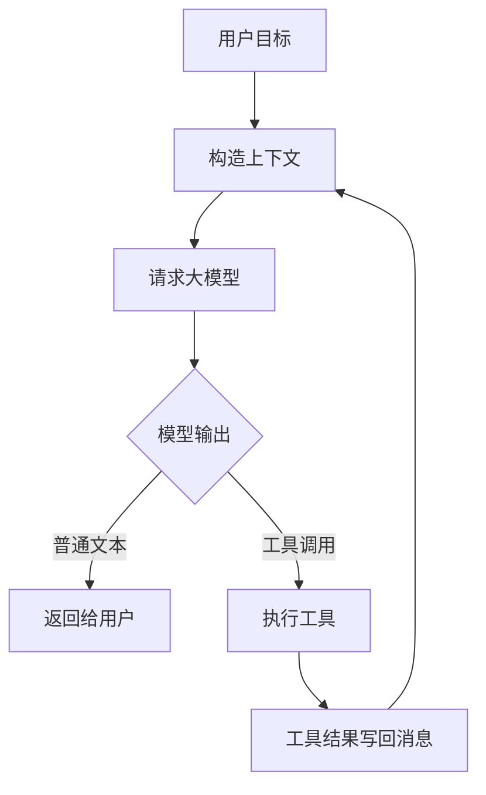
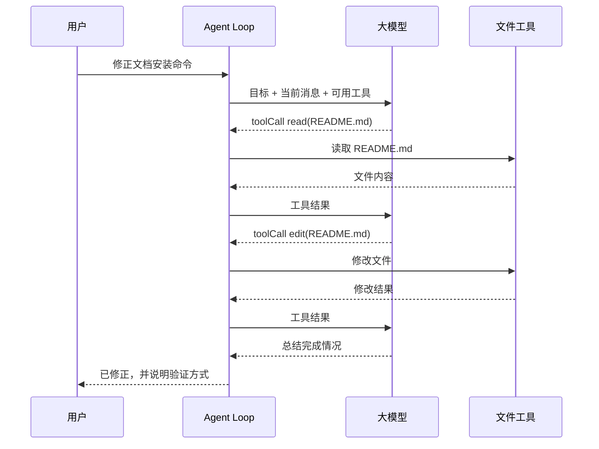

# Agent 到底是什么

很多人第一次听到 Agent，会以为它是“更聪明的聊天机器人”。这个说法只对了一小半。

更工程化的定义是：

> Agent 是一个围绕大模型构建的运行时系统。它维护状态，把用户目标转换成多轮模型请求，允许模型调用工具，接收工具结果，再决定下一步。

换句话说，Agent 不是一个单独的模型调用，而是一条闭环。

## 最小闭环

一个最小 Agent 只需要五个概念：

| 概念 | 做什么 | 如果没有它 |
| --- | --- | --- |
| 消息 `Message` | 保存用户、助手、工具结果 | 模型不知道前面发生过什么 |
| 模型 `Model` | 根据上下文生成下一步 | 系统没有推理和规划能力 |
| 工具 `Tool` | 把模型连接到外部世界 | 只能聊天，不能读文件、执行命令、改代码 |
| 循环 `Loop` | 反复处理“模型输出 -> 工具结果 -> 再请求模型” | 只能执行一步，无法完成复杂任务 |
| 事件 `Event` | 把过程暴露给 UI 和日志 | 前端只能看到最终答案，看不到中间发生了什么 |

## 为什么不是一次请求解决

假设用户说：“读一下 README，帮我修正文档里的安装命令。”

单次请求会遇到三个问题：

1. 模型并不知道 README 的真实内容。
2. 即使模型猜到了问题，也不能真正写文件。
3. 写完以后，它还需要再次检查结果是否正确。

Agent 的做法是把这个任务拆成多轮：

## Pi 的定位

Pi 官方文档把 Pi 称为一个 minimal terminal coding harness。这个说法很关键：Pi 的野心不是把所有工作流都写死进核心，而是保持核心小，把能力放到工具、扩展、技能、提示模板和包里。

参考 Pi 仓库可以看到三层很清楚：

| 包 | 教程里的理解 | 关键职责 |
| --- | --- | --- |
| `@earendil-works/pi-ai` | 模型适配层 | 统一多家模型 API、流式事件、消息格式、工具 schema |
| `@earendil-works/pi-agent-core` | Agent 内核层 | Agent Loop、工具调用、事件、状态、队列 |
| `@earendil-works/pi-coding-agent` | 产品运行层 | 会话管理、资源加载、内置工具、扩展、TUI/RPC/print 模式 |

我们后面的教学版项目会保留这三层思想，但把代码缩小到适合学习的规模。

## 小练习

试着回答：如果一个 Agent 没有工具，只保留消息和模型，它还能算 Agent 吗？

一个合理答案是：可以算最弱形式的 Agent，因为它仍有状态和循环；但它无法观察和改变外部世界，所以在编程任务里能力非常有限。
