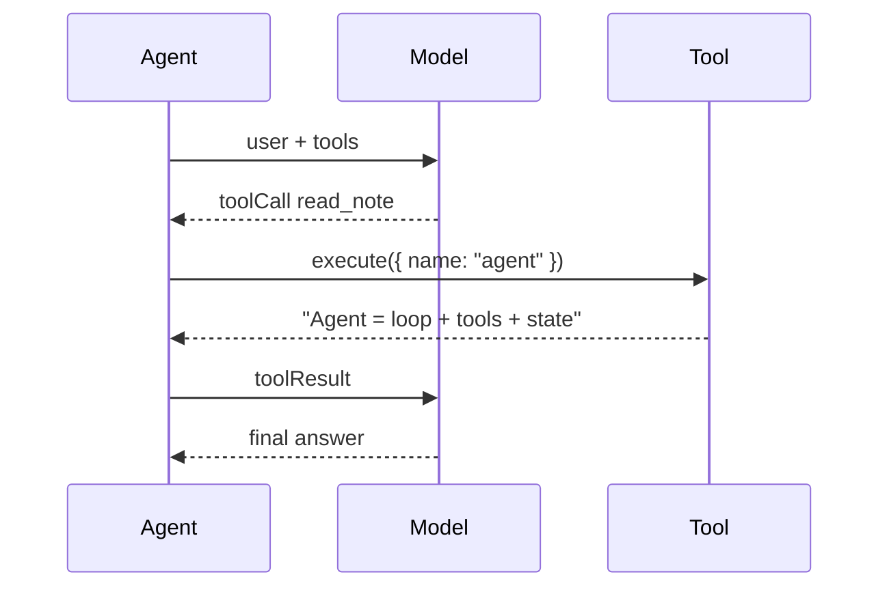

# Demo 2：工具定义与执行

这个 Demo 在最小循环上加入工具调用。

假模型第一轮不会直接回答，而是请求调用 `read_note` 工具。Agent 执行工具后，把结果追加为 `toolResult`，再请求模型。第二轮模型看到工具结果后，生成最终答案。

## 学习目标

跑完这一节，你应该能说清楚：模型只负责提出 `toolCall`，本地运行时负责执行工具，工具结果必须作为 `toolResult` 回写给模型。

## 运行

```bash
npm run demo:02
```

## 流程



## 关键点

工具不是模型自己执行的。模型只产出结构化请求：

```ts
{
  type: "toolCall",
  id: "call_read_note",
  name: "read_note",
  arguments: { name: "agent" }
}
```

运行时根据 `name` 找到本地工具，再执行：

```ts
const tool = tools.find((tool) => tool.name === toolCall.name);
const result = await tool.execute(toolCall.arguments);
```

## 预期输出

```text
assistant toolCall: read_note
tool_start: read_note {"name":"agent"}
tool_result read_note: Agent = loop + tools + state. 工具结果必须回写给模型。
assistant: 我已经读取了笔记：Agent = loop + tools + state. 工具结果必须回写给模型。
```

## 对应最终项目

最终项目把这里的 `tools.find()` 扩展成 `ToolRegistry`，并把工具结果包装成前后端共享的 `ToolResultMessage`。前端时间线里的 `tool_start` / `tool_end` 就来自这条链路。

## 改造练习

新增一个工具：

```ts
{
  name: "now",
  description: "返回当前时间",
  execute: async () => ({ content: new Date().toISOString() })
}
```

然后改假模型，让它在用户提到“时间”时调用 `now`。
