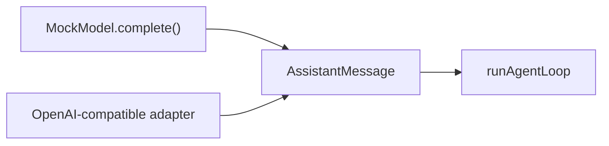

# Demo 5：OpenAI-compatible 真模型烟测

前四个 Demo 都使用确定性假模型。Demo 5 是可选项：当你有 OpenAI-compatible 接口时，用真实模型跑一次“工具调用 -> 本地执行 -> 工具结果回写 -> 最终回答”的链路。

对应文件：

```text
examples/demos/05-openai-compatible.ts
```

## 学习目标

- 理解真实模型接入不应该改变 Agent Loop 的核心协议。
- 学会用环境变量传入 base URL、API Key 和模型名。
- 观察真实模型是否会返回 `tool_calls`。
- 看到工具结果如何按 OpenAI-compatible message 格式回传给模型。
- 理解一个最小 provider adapter 如何把 provider 字段转换成教学版 `AssistantMessage`。

## 运行命令

```bash
OPENAI_COMPATIBLE_BASE_URL="https://example.com/v1" \
OPENAI_COMPATIBLE_API_KEY="你的 key" \
OPENAI_COMPATIBLE_MODEL="模型名" \
OPENAI_COMPATIBLE_AUTH_HEADER="authorization" \
npm run demo:05
```

如果服务商文档要求 `api-key` header：

```bash
OPENAI_COMPATIBLE_AUTH_HEADER="api-key"
```

不要把真实 key 写进 `package.json`、README 或教程正文。
如果不传环境变量，脚本会打印用法并正常跳过，方便你批量运行所有 Demo。

如果你使用 Xiaomi MiMo 的 OpenAI-compatible endpoint，通常可以设置：

```bash
OPENAI_COMPATIBLE_MODEL="mimo-v2.5-pro"
OPENAI_COMPATIBLE_AUTH_HEADER="api-key"
```

## 关键代码

Demo 先把本地工具描述发给模型：

```ts
const tools = [
  {
    type: "function",
    function: {
      name: "list_files",
      description: "List files inside the safe teaching workspace.",
      parameters: {
        type: "object",
        properties: {
          path: { type: "string" },
        },
      },
    },
  },
];
```

如果模型返回 tool call，就在本地执行：

```ts
const entries = await listFiles(resolve(workspaceRoot, path));
messages.push({
  role: "tool",
  tool_call_id: call.id,
  content: entries.join("\n"),
});
```

然后再次请求模型，让模型基于工具结果回答。

Demo 里还包含一个 adapter 函数，把 OpenAI-compatible assistant message 转成教学版协议：

```ts
function toTeachingAssistantMessage(message, finishReason): AssistantMessage {
  const toolCalls = (message.tool_calls ?? []).map((call) => ({
    type: "toolCall",
    id: call.id,
    name: call.function.name,
    arguments: safeJsonParse(call.function.arguments),
  }));

  return {
    role: "assistant",
    content: [
      ...(message.content ? [{ type: "text", text: message.content }] : []),
      ...toolCalls,
    ],
    stopReason: finishReason === "tool_calls" || toolCalls.length > 0 ? "toolUse" : "stop",
    usage: { input: 0, output: 0, totalTokens: 0 },
    timestamp: Date.now(),
  };
}
```

读这段时记住一个原则：provider 字段只在 adapter 里出现，后面的 Agent Loop 继续只认教学版 `AssistantMessage`。

## 预期输出

不同模型输出会有差异，但大致应包含：

```text
[demo:05] requesting model: your-model
[demo:05] local tool list_files output:
README.md
agent-notes.md
[demo:05] final answer:
教学工作区里有 README.md 和 agent-notes.md...
```

如果模型没有返回 tool call，Demo 会打印它的直接回答。这不是脚本错误，而是模型行为差异；可以调整 prompt、模型名或工具描述再试。

如果模型连续请求工具超过 4 轮，Demo 会停止。这是为了演示真实 Agent 必须有无限 tool call 保护。

## 和最终项目的关系

Demo 5 不替换教学版 Agent 的默认 `MockModel`。它只展示一个替换方向：



只要 adapter 返回同样的 `AssistantMessage`，后面的 loop、工具和会话系统就可以继续复用。

更完整的 adapter 设计见 [可选：接入 OpenAI-compatible 模型](/project/build-08-real-model)。

## 小练习

把 `list_files` 改成 `read_file`，让模型读取 `agent-notes.md` 并总结。你需要同时修改工具 schema、本地工具执行函数和用户 prompt。
