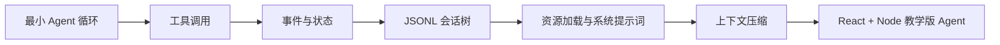

## 这套教程适合谁

你不需要已经写过 Agent 框架，但最好具备这些基础：TypeScript、Node.js、HTTP API、React 的基本状态管理，以及能读懂一些异步代码。

这套教程默认读者是计算机本科毕业生：已经知道“调用大模型 API”是什么，但还没有把“模型、工具、状态、流式事件、会话持久化”串成一个完整系统。

## 你会学到什么

## 站点中的代码

教程中的小 Demo 位于 `examples/demos/`，最终项目位于 `examples/teaching-agent/`。你可以先读概念，再运行代码；也可以反过来，先跑起来再回头看解释。

## 联系与赞助

原 README 里的作者联系方式与赞助二维码已经整理到 [联系与赞助](/contact)。如果这套教程帮你把 Agent 系统想清楚了，欢迎去那里找作者继续交流。
