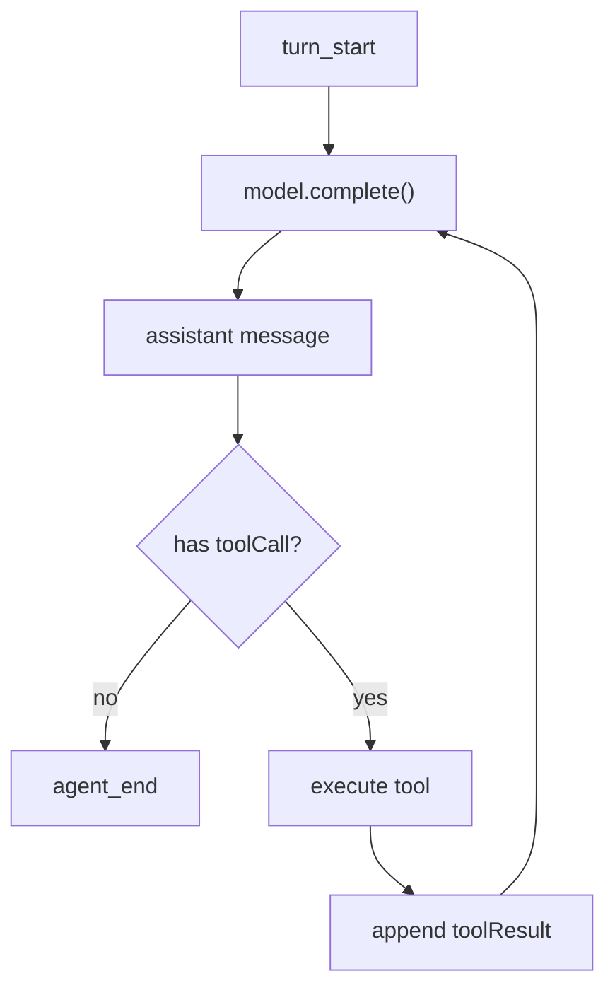

# Step 2：Loop 与 MockModel

这一步先不写 HTTP，也不写 React。我们只关心一件事：给定上下文、模型和工具定义，Agent Loop 能不能一轮轮推进。

对应文件：

```text
examples/teaching-agent/src/server/agent/loop.ts
examples/teaching-agent/src/server/agent/mockModel.ts
examples/teaching-agent/src/server/agent/message.ts
```

## 本节新增文件

```text
src/server/agent/message.ts
src/server/agent/model.ts
src/server/agent/mockModel.ts
src/server/agent/loop.ts
```

这一步只在内存里跑通 loop，不接 Express，不写 JSONL。先让 Agent 的“心跳”动起来。

## 先写消息 helper

```ts
import type { AgentMessage, AssistantMessage, TextContent, UserMessage } from "../../shared/protocol";

export function text(value: string): TextContent {
  return { type: "text", text: value };
}

export function createUserMessage(input: string): UserMessage {
  return { role: "user", content: [text(input)], timestamp: Date.now() };
}

export function createAssistantMessage(
  content: AssistantMessage["content"],
  stopReason: AssistantMessage["stopReason"] = "stop",
): AssistantMessage {
  return {
    role: "assistant",
    content,
    stopReason,
    usage: { input: 0, output: 0, totalTokens: 0 },
    timestamp: Date.now(),
  };
}

export function messageText(message: AgentMessage): string {
  return message.content.filter((block) => block.type === "text").map((block) => block.text).join("\n");
}
```

## 再写模型接口和 MockModel 的最小版本

```ts
import type { AgentMessage, AssistantMessage, ToolDefinition } from "../../shared/protocol";
import { createAssistantMessage, messageText, text } from "./message";

export type CompleteInput = {
  systemPrompt: string;
  messages: AgentMessage[];
  tools: ToolDefinition[];
};

export interface TeachingModel {
  complete(input: CompleteInput): Promise<AssistantMessage>;
}

export class MockModel implements TeachingModel {
  async complete(input: CompleteInput): Promise<AssistantMessage> {
    const last = input.messages[input.messages.length - 1];
    if (!last) return createAssistantMessage([text("还没有上下文。")]);

    if (last.role === "toolResult") {
      return createAssistantMessage([text(`我看到了工具结果：${messageText(last)}`)]);
    }

    if (last.role === "user" && messageText(last).includes("文件")) {
      return createAssistantMessage(
        [{ type: "toolCall", id: `call_${Date.now()}`, name: "list_files", arguments: { path: "." } }],
        "toolUse",
      );
    }

    return createAssistantMessage([text("教学版 Agent 收到你的问题。")]);
  }
}
```

这不是“智能模型”，它只是稳定地产生 tool call。稳定性正是教学阶段需要的。

真实仓库里接口放在 `model.ts`，`MockModel` 放在 `mockModel.ts`。教程这里合在一个代码块里展示，是为了让你先看清边界：loop 依赖的是 `TeachingModel` 接口，不是某个具体 provider。

## 为什么先用 MockModel

真实模型会引入很多额外变量：API Key、网络、provider tool call 格式、流式事件、速率限制。教学版先用确定性 `MockModel`，让你专注 Agent Loop。

`MockModel` 的职责是模拟“模型已经理解了工具协议”：

| 用户输入 | MockModel 行为 |
| --- | --- |
| 包含“列出”或“文件” | 返回 `list_files` tool call |
| 包含“读取”或文件名 | 返回 `read_file` tool call |
| 包含“笔记” | 返回 `write_note` tool call |
| 已经看到 toolResult | 返回最终回答 |

## Loop 的输入输出

```ts
type RunAgentLoopOptions = {
  systemPrompt: string;
  messages: AgentMessage[];
  tools: ToolDefinition[];
  model: TeachingModel;
  toolRegistry: ToolRegistry;
  maxTurns?: number;
  beforeToolCall?: BeforeToolCall;
  onEvent?: (event: AgentEvent) => void;
};
```

如果你从空目录跟做，先让 `loop.ts` 返回 `newMessages/events`，不要在这里写文件。文件持久化会在 Step 5 的 API 层完成。

返回值只包含本次新增内容：

```ts
{
  newMessages: AgentMessage[];
  events: AgentEvent[];
}
```

为什么不直接返回完整 session？因为 loop 不应该知道会话文件、HTTP 响应和前端状态。它只做状态转换。

`beforeToolCall` 是工具执行前的权限 hook。第一版可以先不实现，等 loop 跑通后再加；完整仓库已经实现了 `allow`、`block` 和 `rewrite` 三种决策。

## 主循环

```ts
for (let turn = 1; turn <= maxTurns; turn++) {
  emit({ type: "turn_start", turn });

  const assistant = await model.complete({ systemPrompt, messages: context, tools });
  context.push(assistant);
  newMessages.push(assistant);

  const toolCalls = assistant.content.filter((block) => block.type === "toolCall");
  if (toolCalls.length === 0) {
    emit({ type: "agent_end", messages: newMessages });
    return { newMessages, events };
  }

  for (const toolCall of toolCalls) {
    const toolResult = await executeToolCall(toolCall, toolRegistry);
    context.push(toolResult);
    newMessages.push(toolResult);
  }
}
```

这里保留了 Pi Loop 的核心骨架：



## 事件怎么发

教学版用 `emitMessageLifecycle()` 模拟流式生命周期：

```ts
emit({ type: "message_start", message });
emit({ type: "message_update", message, delta: block.text });
emit({ type: "message_end", message });
```

真实 Pi 的事件会更细，比如 thinking delta、tool call delta、provider response 等。但 UI 思路一样：事件驱动界面，消息作为事实来源。

## 最大轮次保护

如果模型一直调用工具，loop 会无限循环。所以教学版有 `maxTurns`：

```ts
const guardrail = createLoopGuardrailMessage(maxTurns);
```

这不是可有可无的小细节。任何 Agent Loop 都需要停止条件：

| 停止条件 | 说明 |
| --- | --- |
| assistant 没有 tool call | 正常完成 |
| assistant stopReason 是 error/aborted | 异常完成 |
| 达到 maxTurns | 防止循环失控 |
| 外部 AbortSignal | 用户主动中止，教学版未完整实现 |

## 运行检查

先启动完整项目：

```bash
npm run teaching-agent:dev
```

提交“列出工作区文件”后，预期后端会经历：

```text
turn 1 -> assistant toolCall(list_files)
tool_execution_start -> tool_execution_end
turn 2 -> assistant final answer
agent_end
```

你可以在前端 Event Timeline 里看到这条链路。

如果你还没写 API，可以临时建一个 `src/server/smoke.ts`：

```ts
import { runAgentLoop } from "./agent/loop";
import { createUserMessage } from "./agent/message";
import { MockModel } from "./agent/mockModel";

const result = await runAgentLoop({
  systemPrompt: "你是教学 Agent。",
  messages: [createUserMessage("列出工作区文件")],
  tools: [{ name: "list_files", description: "List files.", parameters: { type: "object" } }],
  model: new MockModel(),
  toolRegistry: {
    definitions: () => [],
    execute: async () => ({ content: [{ type: "text", text: "README.md" }] }),
  },
});

console.log(result.newMessages.map((message) => message.role));
```

运行：

```bash
npx tsx src/server/smoke.ts
```

预期至少看到：

```text
[ 'assistant', 'toolResult', 'assistant' ]
```

## 常见错误

| 错误 | 后果 |
| --- | --- |
| 工具执行后不把 toolResult push 回 context | 模型下一轮不知道工具输出 |
| loop 内直接写 JSONL | 后续难以测试，也难以复用 |
| 没有 maxTurns | 模型反复 tool call 时进程卡死 |
| 捕获工具错误后直接 throw | UI 和 session 都收不到可解释结果 |

## 小练习

把 `maxTurns` 改成 `1`，再输入“读取 agent-notes.md”。观察为什么 Agent 只能产生 tool call，却来不及基于工具结果回答。这个练习会让你真正理解“工具调用通常要两轮模型请求”。

## 本节 checkpoint

```bash
git add src/server/agent
git commit -m "step 2: add mock model and agent loop"
```
